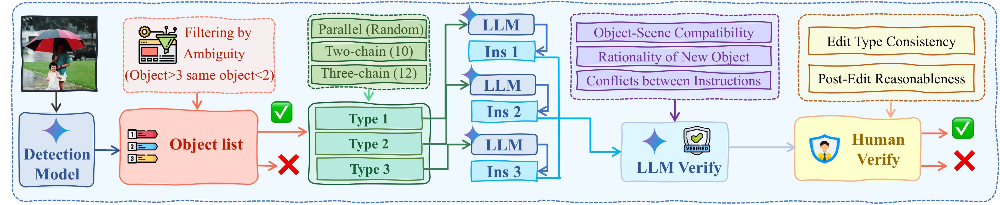

<h1 align="center" style="line-height: 50px;">
  ComplexBench-Edit: Benchmarking Complex Instruction-Driven
Image Editing via Compositional Dependencies
</h1>

# 🌍 Introduction

`ComplexBench-Edit` is a  benchmark for image editing specifically designed to assess performance on complex instructions involving multiple combined and dependent modifications. Our benchmark systematically evaluates howwell models can handle both parallel and, critically, chain-dependent instructions. Furthermore, we propose a novel vision consistency evaluation method that excludes the influence of modified content by assessing consistency only in the remaining, unaltered regions. We also introduce a simple yet powerful CoT-based approach for image editing.


## ✨ TODO

- [ ] Show the comparison results between different baselines and GPT-4o.
- [ ] Release ComplexBench-Edit Benchmark.
- [x] Release evaluation code.

# ⭐ Benchmark Collection



# 🛠️ Setup

1.  **Clone the repository:**
    ```bash
    git clone https://github.com/llllly26/ComplexBench-Edit
    cd ComplexBench-Edit
    ```
2.  **Install Dependencies:**
    ```bash
    pip install -r requirements.txt
    ```
3.  **Download Datasets:** (put the source images in `data/more-object-no-multi3` directory or please view the data in [TODO](https://github.com/llllly26/ComplexBench-Edit))

# 🧳 Project Folder Structure

```
ComplexBench-Edit/
├── LICENSE
├── README.md
├── baselines/                  # Contains implementations of some baseline models
│   ├── Gemini-CoT/             # Example: Gemini CoT baseline
│   ├── icedit.py
├── data/                       # Contains benchmark images and instructions in json file.
    │   ├── instructions/
    │   │   ├── COCO-obj-attr-global/
    │   │   ├── COCO-three-obj/
    │   │   ├── COCO-two-obj-one-attr/
    │   │   ├── three-chain/
    │   │   └── two-chain/
    │   ├── more-object-no-multi3/
├── edited-image/               # Stores editing images of models
│   └── Gemini/                 # Example: Images edited by Gemini
└── evaluation/                 # Contains evaluation scripts and prompts
    ├── count_score.py
    ├── eval-detection.py
    ├── eval_prompt/            # Evaluation prompts
    ├── final_score.py
    ├── get-bbox.py
    ├── ins_eval.py
    └── read.txt
```

# 🚀 Running Baselines and Evaluation

**Example for running a baseline:**
```bash
python .\baselines\icedit.py
```

**Example for running evaluation of instruction following:**
```bash
python .\evaluation\ins_eval.py --results_folder ".\edited-image\Gemini\COCO-three-obj\testResults_42" --json_path ".\data\COCO-three-obj\final_update_v2.json" --output_dir ".\edited-image\Gemini\COCO-three-obj\testResults_42_eval_v3_thinking_01_21"
```

# 🎈 Case Editing Results