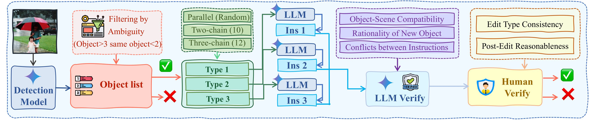

<h2 align="center" style="line-height: 40px;">
  🎨ComplexBench-Edit: Benchmarking Complex Instruction-Driven
Image Editing via Compositional Dependencies
</h2>

<p align="center">
<a href="https://arxiv.org/pdf/2506.12830">
    
</a>
<a href="https://huggingface.co/datasets/liyyy/ComplexBench-Edit">
    
</a>
<a href="https://github.com/llllly26/ComplexBench-Edit">
    
</a>

</p>

# 🌍 Introduction

`ComplexBench-Edit` is a  benchmark for image editing specifically designed to assess performance on complex instructions involving multiple combined and dependent modifications. Our benchmark systematically evaluates howwell models can handle both parallel and, critically, chain-dependent instructions. Furthermore, we propose a novel vision consistency evaluation method that excludes the influence of modified content by assessing consistency only in the remaining, unaltered regions. We also introduce a simple yet powerful CoT-based approach for image editing.


# 🔥 News

- [2025.6.3] We release the comparison cases between different baselines and GPT-4o.
- [2025.6.2] We release the source image and editing instructions about ComplexBench-Edit Benchmark.
- [2025.6.1] We release the evaluation code.

# ⭐ Benchmark Collection



# 🛠️ Setup

1.  **Clone the repository:**
    ```bash
    git clone https://github.com/llllly26/ComplexBench-Edit
    cd ComplexBench-Edit
    ```
2.  **Install Dependencies:**
    ```bash
    pip install -r requirements.txt
    ```
3.  **Download Datasets:** The source image could be downloaded from [ [**Here**](https://drive.google.com/drive/folders/1G7O6LrYEwqls4dSA-iDlqK_2WH3nlF_F?usp=drive_link) ], put the source images in `data/more-object-no-multi3` directory. Overview of data could be found in [](https://huggingface.co/datasets/liyyy/ComplexBench-Edit)

# 🧳 Project Folder Structure

```
ComplexBench-Edit/
├── LICENSE
├── README.md
├── baselines/                  # Contains implementations of some baseline models
│   ├── icedit.py
├── data/                       # Contains benchmark images and instructions in json file.
    │   ├── instructions/
    │   │   ├── COCO-obj-attr-global/
    │   │   ├── COCO-three-obj/
    │   │   ├── COCO-two-obj-one-attr/
    │   │   ├── three-chain/
    │   │   └── two-chain/
    │   ├── more-object-no-multi3/
├── edited-image/               # Stores editing images of models
│   └── Gemini/                 # Example: Images edited by Gemini
└── evaluation/                 # Contains evaluation scripts and prompts
    ├── count_score.py
    ├── eval-detection.py
    ├── eval_prompt/            # Evaluation prompts
    ├── final_score.py
    ├── get-bbox.py
    ├── ins_eval.py
    └── read.txt
```

# 🚀 Running Baselines and Evaluation

For the evaluations of all baselines, we utilize the demo code parameters provided in their respective original repositories. Thanks for all the authors.

**Example for running a baseline:**
```bash
python .\baselines\icedit.py
```

**Example for running evaluation of instruction following:**
```bash
python .\evaluation\ins_eval.py --results_folder ".\edited-image\Gemini\COCO-three-obj\testResults_42" --json_path ".\data\COCO-three-obj\final_update_v2.json" --output_dir ".\edited-image\Gemini\COCO-three-obj\testResults_42_eval_v3_thinking_01_21"
```

# 🎈 Case Editing Results
Here, we showcase several examples from our ComplexBench-Edit benchmark. The image demonstrates the evaluation results of leading instruction-driven editing methods, including GPT-4o.


## Citation
If you find that this work is useful for your research, please kindly give a star ⭐ and consider citation:
```
@misc{wang2025complexbencheditbenchmarkingcomplexinstructiondriven,
      title={ComplexBench-Edit: Benchmarking Complex Instruction-Driven Image Editing via Compositional Dependencies}, 
      author={Chenglin Wang and Yucheng Zhou and Qianning Wang and Zhe Wang and Kai Zhang},
      year={2025},
      eprint={2506.12830},
      archivePrefix={arXiv},
      primaryClass={cs.CV},
      url={https://arxiv.org/abs/2506.12830}, 
}
```